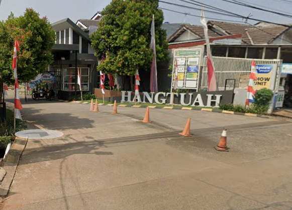

<div align="center">

# 🏡 RT MANAGER
### Sistem Informasi Manajemen Rukun Tetangga (RT) Modern, Cerdas & Tanggap Darurat
**RT 04 · Perumahan Hangtuah · Grand Residence City**

[](https://reactnative.dev/)
[](https://expo.dev/)
[](https://www.typescriptlang.org/)
[](https://sqlite.org/)
[](https://supabase.com/)
[](LICENSE)

<br/>



</div>

---

## 📖 Tentang Aplikasi

**RT Manager** adalah aplikasi pengelolaan rukun tetangga berbasis *Offline-First* dan *Cloud-Connected* yang dirancang untuk mempermudah operasional pengurus RT dan meningkatkan keamanan serta transparansi keuangan bagi seluruh warga.

Aplikasi ini dapat diakses secara fleksibel dari berbagai platform: **Web Browser (Desktop/Laptop)**, **Tablet**, maupun di-install langsung sebagai **Aplikasi Android (.APK)** di smartphone pengurus dan warga.

---

## ✨ Fitur Unggulan

### 🚨 1. Pusat Darurat & Tombol Panik (Panic Button)
- **Alarm Sirine Audio Synthesizer**: Menghasilkan bunyi sirine peringatan darurat secara realtime langsung dari browser/aplikasi.
- **Deteksi GPS Lokasi Akurat**: Mendeteksi koordinat lintang/bujur lokasi pelapor dan menyediakan tombol navigasi langsung ke Google Maps.
- **Kamera & Upload Bukti Foto**: Pengambilan foto situasi darurat (kebakaran, pencurian, medis, pohon tumbang, dll).
- **Integrasi Keamanan Cepat**: Panggilan darurat sekali klik (`tel:`) dan pesan WhatsApp darurat terstruktur otomatis ke pos security.

### 👥 2. Multi-Role Authentication & Verifikasi OTP
Sistem otentikasi 2-langkah (*Two-Factor Authentication*) berbasis peran (RBAC) dengan kode OTP 6-digit:
- 👑 **Super Admin (Developer)**: Akses kontrol penuh sistem, konfigurasi master, dan menu manajemen akun pengurus.
- 🏛️ **Ketua RT**: Akses monitoring seluruh aktivitas RT, laporan warga, surat pengantar, dan pos darurat.
- 🤝 **Wakil Ketua RT**: Mendampingi ketua dalam pengelolaan warga, ronda malam, surat, dan agenda.
- 💰 **Bendahara RT**: Pengelolaan arus kas RT, penagihan iuran KK, dan penerbitan laporan keuangan.
- 📝 **Sekretaris RT**: Administrasi kependudukan KK/warga, pencatatan surat pengantar, buku tamu, dan pengumuman.

### 📊 3. Export Laporan Keuangan Resmi
- 📊 **Microsoft Excel (`.xls`)**: Format spreadsheet lengkap dengan pewarnaan tema tabel, pemisahan kolom presisi (A-F), dan format Rupiah untuk pembukuan digital.
- 📄 **Dokumen PDF (`.pdf`)**: Format cetak A4 siap print lengkap dengan Kop Surat Resmi RT 04, tabel rekap bulanan, rincian transaksi kas, serta kolom tanda tangan basah Ketua dan Bendahara RT.

### 👨‍👩‍👧‍👦 4. Administrasi Kependudukan & Layanan Warga
- **Data Kartu Keluarga (KK) & Warga**: Pencatatan NIK, nomor telepon, status perkawinan, pekerjaan, dan hubungan keluarga.
- **Iuran Warga Bulanan**: Tracking status pembayaran (Lunas / Belum Bayar) per bulan dan tahun.
- **Pengajuan Surat Pengantar**: Penerbitan surat pengantar online untuk berbagai keperluan administrasi kelurahan/kecamatan.
- **Buku Tamu Digital**: Pencatatan riwayat tamu dan pihak luar yang berkunjung ke lingkungan perumahan.
- **Agenda & Kegiatan RT**: Kalender kegiatan kerja bakti, rapat warga, dan perayaan hari besar.
- **Jadwal Ronda Malam**: Penjadwalan pos kamling dan petugas ronda lingkungan.

### ☁️ 5. Offline-First & Cloud Synchronization
- Bekerja 100% secara offline tanpa internet menggunakan **SQLite Database** lokal yang sangat cepat.
- Fitur **Cloud Sync** untuk mencadangkan (*backup*) dan memulihkan (*restore*) seluruh data ke database **Supabase Cloud (PostgreSQL)**.

---

## 🔑 Akun Bawaan (Default Pengurus)

| Role | Username | No. Handphone | Password | Hak Akses |
|---|---|---|---|---|
| 👑 **Super Admin** | `admin` | `08119547505` | `admin123` | Akses Penuh + Kelola Pengurus |
| 🏛️ **Ketua RT** | `ketuart` | `081234567891` | `ketua123` | Dashboard, Warga, Kas, Surat, Darurat |
| 🤝 **Wakil Ketua** | `wakilrt` | `081234567892` | `wakil123` | Warga, Kegiatan, Ronda, Darurat |
| 💰 **Bendahara** | `bendahara` | `081234567893` | `bendahara123` | Kas RT, Iuran KK, Export Excel/PDF |
| 📝 **Sekretaris** | `sekretaris` | `081234567894` | `sekretaris123` | Data KK/Warga, Surat, Buku Tamu |

---

## 🛠️ Tech Stack & Arsitektur

- **Framework**: [Expo SDK 57](https://expo.dev/) (React Native 0.76+)
- **Routing**: [Expo Router v4](https://docs.expo.dev/router/introduction/) (File-based navigation)
- **Language**: [TypeScript](https://www.typescriptlang.org/)
- **Local Database**: [Expo SQLite](https://docs.expo.dev/versions/latest/sdk/sqlite/) (WAL Mode enabled)
- **Cloud Backend**: [Supabase](https://supabase.com/) (PostgreSQL & Row Level Security)
- **Icons & Theme**: [@expo/vector-icons](https://icons.expo.fyi/) & Dynamic Dark/Light Theme

---

## 🚀 Panduan Menjalankan Project

### 1. Clone Repository
```bash
git clone https://github.com/dimaslukman-rgb/rt-manager.git
cd rt-manager
```

### 2. Install Dependensi
```bash
npm install
```

### 3. Setup Environment Variables (Opsional untuk Supabase)
Salin file `.env.example` menjadi `.env`:
```bash
cp .env.example .env
```
Isi kredensial Supabase Anda (jika ingin mengaktifkan Cloud Sync):
```env
EXPO_PUBLIC_SUPABASE_URL=https://your-project.supabase.co
EXPO_PUBLIC_SUPABASE_PUBLISHABLE_KEY=your-anon-key
```

### 4. Jalankan Development Server
```bash
npx expo start
```

Pilihan tombol di terminal:
- Tekan **`w`** untuk membuka di **Web Browser** (`http://localhost:8081`).
- Tekan **`a`** untuk membuka di **Emulator Android**.
- Scan **QR Code** menggunakan aplikasi **Expo Go** di HP Anda.

---

## 📱 Build Production

### Deploy Web ke Vercel / Netlify
```bash
npx expo export --platform web
```
Upload folder `dist/` atau hubungkan langsung repository GitHub ini ke [Vercel](https://vercel.com).

### Build APK Android (EAS Build)
```bash
npm install -g eas-cli
npx eas login
npx eas build -p android --profile preview
```

---

## 📄 Lisensi

Didistribusikan di bawah lisensi **MIT License**. Lihat `LICENSE` untuk informasi lebih lengkap.

<div align="center">
  <sub>Dibuat dengan ❤️ untuk kemajuan warga <b>RT 04 · Perumahan Hangtuah · Grand Residence City</b></sub>
</div>
